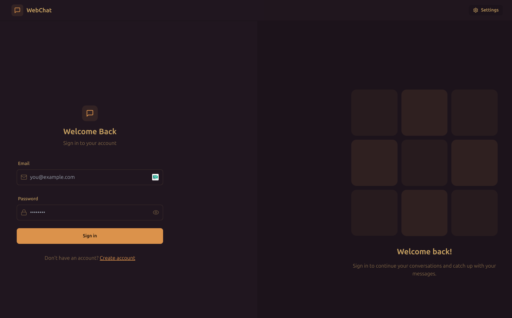
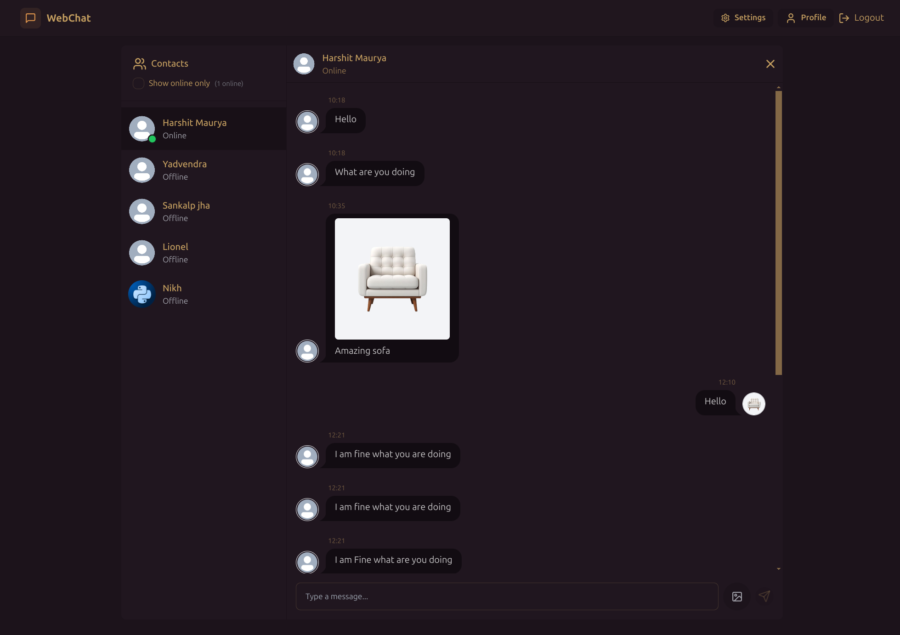

# 🚀 Real-Time Chat App  

A full-stack real-time chat application built with **MERN Stack, Socket.io, TailwindCSS, and Daisy UI**. 
Deployed - [WebChat](https://webchat-ezl0.onrender.com/)

## 🔥 Features  

- **Authentication & Authorization** with JWT  
- **Real-time messaging** using **Socket.io**  
- **Live online user status** tracking  
- **Global state management** with Zustand  
- **Cloudinary** integration for media storage  
- **Error handling** on both client & server  
- **Optimized build & free deployment**  

## 🛠️ Installation & Setup  

### Clone the Repository  
```sh
git clone https://github.com/Harshit-Maurya838/WebChat.git
cd WebChat
```

## 🔑 Environment Variables  

Create a **`.env`** file in the **server** directory and add the following:  

```env
MONGODB_URI=your_mongodb_connection_string
PORT=8000
JWT_SECRET=your_jwt_secret

CLOUDINARY_CLOUD_NAME=your_cloudinary_cloud_name
CLOUDINARY_API_KEY=your_cloudinary_api_key
CLOUDINARY_API_SECRET=your_cloudinary_api_secret

NODE_ENV=development
```

## 🚀 Running the Project  

### Backend  
```sh
npm start  
```

### Frontend  
```sh
npm run dev  
```

## 📦 Build & Deployment  

### Build the Frontend  
```sh
npm run build
```

### Start the Server  
```sh
npm start
```

## 📸 UI Preview  

 
 

## 📝 Feedback & Contributions  

This project was a great learning experience, and I’d love to hear your thoughts! Feel free to **share feedback on the UI and overall experience**. 🚀  

## 📜 License  

This project is licensed under the **MIT License**. See the [LICENSE](./LICENSE) file for details.  

### **Acknowledgment**  
This project is based on the original work of **Burak** [Original Repository Link](https://github.com/burakorkmez/fullstack-chat-app), which is licensed under MIT. Modifications and enhancements have been made for learning and development purposes.  
